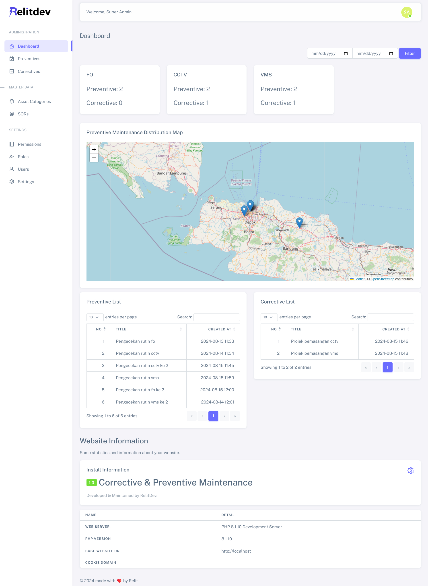

{
  "title": "Aplikasi Routine and Preventive Maintenance",
  "date": "2025-01-10T00:14:07+07:00",
  "draft": false,
  "featured": true,
  "excerpt": "Aplikasi Routine and Preventive Maintenance untuk monitoring pekerjaan baik itu pergantian aset atau pemeliharaan aset",
  "thumbnail": "aplikasi-routine-and-preventive-maintenance-thumbnail.jpg"
}

### Aplikasi Routine and Preventive Maintenance

Aplikasi Routine and Preventive Maintenance untuk monitoring pekerjaan baik itu pergantian aset atau pemeliharaan aset

### Fitur Utama
- **Manajemen Konten:** Tambahkan, edit, dan hapus dengan mudah.
- **Responsif:** Desain ramah mobile untuk semua jenis perangkat.
- **SEO Friendly:** Dilengkapi fitur SEO bawaan.
- **Teknologi yang Digunakan:** Laravel, Bootstrap, MySQL.

### Tangkapan Layar

### Tautan
- [Demo Proyek](https://www.agungpalumagada.com/)
- [Repositori GitHub](#!)