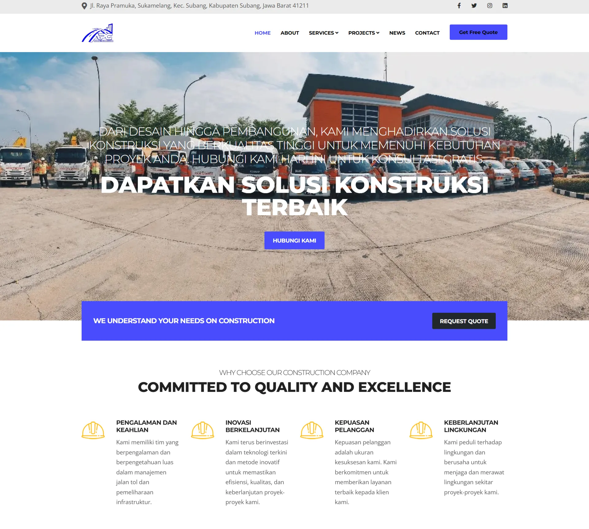

{
  "title": "Laravel Cms Construction",
  "date": "2025-01-09T23:10:54+07:00",
  "draft": false,
  "featured": true,
  "excerpt": "Laravel Cms Construction ini dibangun menggunakan Laravel khusus untuk jasa kontruksi atau arsitek",
  "thumbnail": "cms-kontruksi-thumbnail.jpg"
}

### CMS untuk Jasa Kontruksi

CMS ini dirancang untuk mempermudah pengelolaan portofolio, klien, dan proyek untuk bisnis konstruksi atau arsitektur.

### Fitur Utama
- **Manajemen Konten:** Tambahkan, edit, dan hapus dengan mudah.
- **Responsif:** Desain ramah mobile untuk semua jenis perangkat.
- **SEO Friendly:** Dilengkapi fitur SEO bawaan.
- **Teknologi yang Digunakan:** Laravel, Bootstrap, MySQL.

### Tangkapan Layar

### Tautan
- [Demo Proyek](https://www.agungpalumagada.com/)
- [Repositori GitHub](#!)
